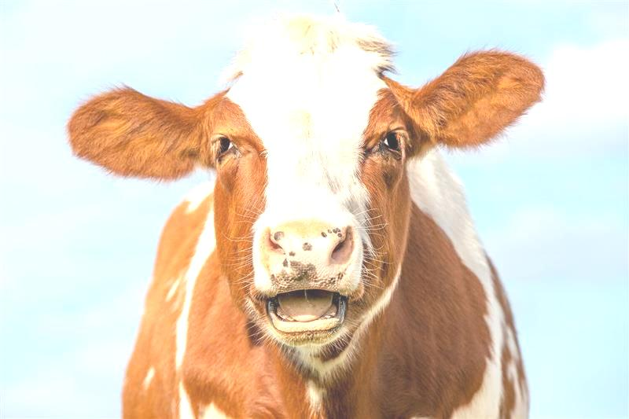
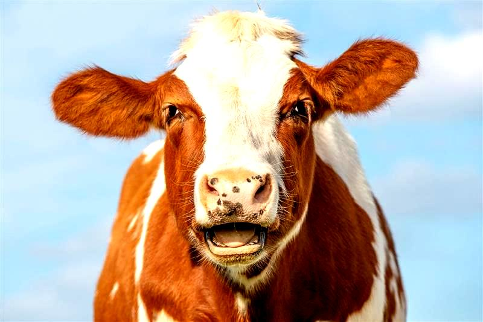
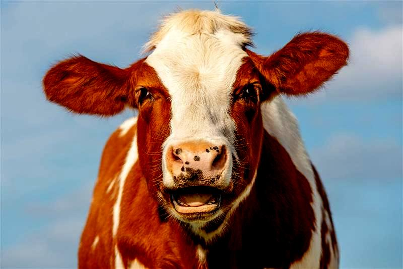
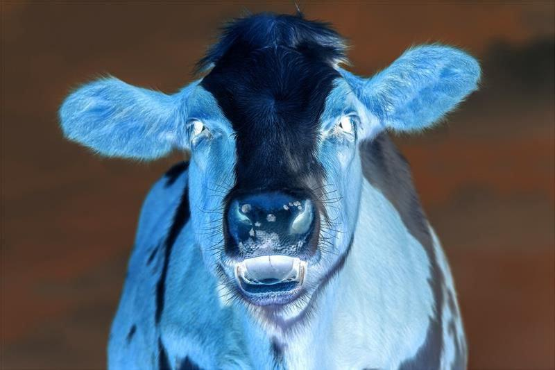
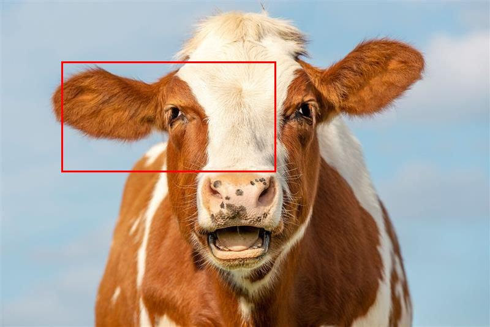
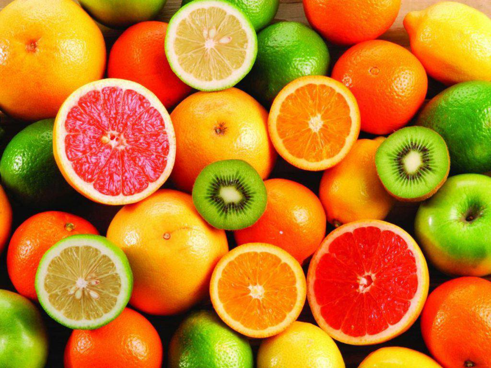
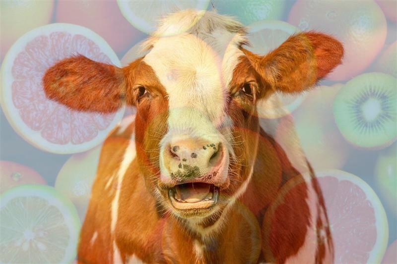
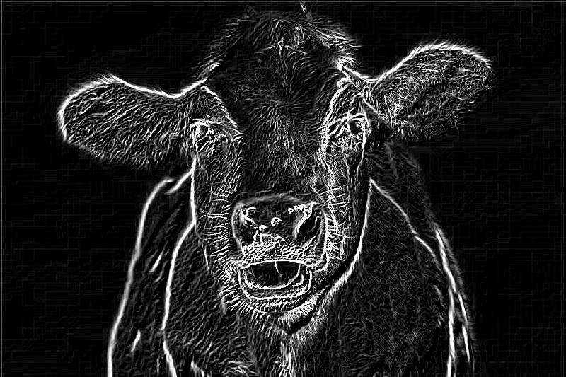

# mudp-proj
## ImageChanger class

Class ***ImageChanger*** provide several functions to change the input RGB images as well as Black-White

### Start 
To start working with class, first create new object of ***ImageChanger*** using follow code:
```
with Image.open('images/cow.jpg') as img:
    img.load()

im_ch = ImageChanger(image=img)
```

### Functions

#### 1. change_brightness(brightness)  

return copy of initial image with other level of brightness;  

 __brightness__ ∈ [-255, 255]
 * brightness = 0 return unchanged image;  
 * brightness ∈ [-255, 0) return image with low level of brightness;  
 * brightness ∈ (0, 255] return image with high level of brightness.

```    
new = im_ch.change_brightness(60)
new.show()
```

| Before                     | After                            |
|----------------------------|----------------------------------|
|  |  |

#### 2. change_contrast(contrast)  

return copy of initial image with other level of contrast;  

 __contrast__ ∈ [0.0, ...) 
 * contrast = 1 return unchanged image;
 * contrast ∈ [0, 1) return image with low level of contrast;
 * contrast > 1 return image with high level of contrast.

```    
new = im_ch.change_contrast(1.5)
new.show()
```

| Before                     | After                               |
|----------------------------|-------------------------------------|
|  |  |

#### 3. change_contrast_n_brightness(contrast, brightness)  

return copy of initial image with other level of contrast and brightness;  

 __contrast__ ∈ [0.0, ...) 
 * contrast = 1 return unchanged image;
 * contrast ∈ [0, 1) return image with low level of contrast;
 * contrast > 1 return image with high level of contrast.

__brightness__ ∈ [-255, 255]
 * brightness = 0 return unchanged image;  
 * brightness ∈ [-255, 0) return image with low level of brightness;  
 * brightness ∈ (0, 255] return image with high level of brightness.

```    
new = im_ch.change_contrast_n_brightness(contrast=1.5, brightness=-60)
new.show()
```

| Before                     | After                                 |
|----------------------------|---------------------------------------|
|  |  |


#### 4. inverse_colors()  

return copy of initial image with inverted colors;  

```    
new = im_ch.inverse_colors()
new.show()
```

| Before                     | After                              |
|----------------------------|------------------------------------|
|  |  |


#### 5. select_frame(point1, point2)  

return copy of initial image with painted rectangle with corners on point1 and point2;  

```    
new = im_ch.select_frame((100, 100), (550, 380))
new.show()
```

| Before                     | After                            |
|----------------------------|----------------------------------|
|  |  |

#### 6. blend_image(another_image, level)  

return new image of smaller size 
        as the result of blending of both images according to level argument


__another_image__ is image to blend with;  

__level__ ∈ [0, 1]
* level = 0 return just second image (another_image)
* level = 1 return just first image (self.image)
* level ∈ (0, 1) return mixed image with _level_*100% of first image
            and (1-_level_)*100% of second one
```    
with Image.open('images/fruits.jpg') as another_img:
    another_img.load()

new = im_ch.blend_image(another_img, 0.8)
new.show()
```

| Before                                                         | After                            |
|----------------------------------------------------------------|----------------------------------|
|  <br/>  |  |

  
#### 7. blurr_image(method, kernel_size, padding_style)  

return copy of initial image with paddings* and blurr it by chosen method.

__method__ ∈ [Blurr.MEAN, Blurr.GAUSS]  
__kernel_size__ >=3  
__padding_style__ ∈ [Style.BLACK, Style.MIRROR, Style.CLAMP]

*(padding size = kernel_size//2)
```    
new = im_ch.blurr_image(method=Blurr.GAUSS, padding_style=Style.MIRROR, kernel_size=12)
new.show()
```

| Before                     | After                            |
|----------------------------|----------------------------------|
|  |  |


#### 8. detect_edge()  

return image with edges located on the initial image.

```    
new = im_ch.detect_edge()
new.show()
```

| Before                     | After                           |
|----------------------------|---------------------------------|
|  |  |


